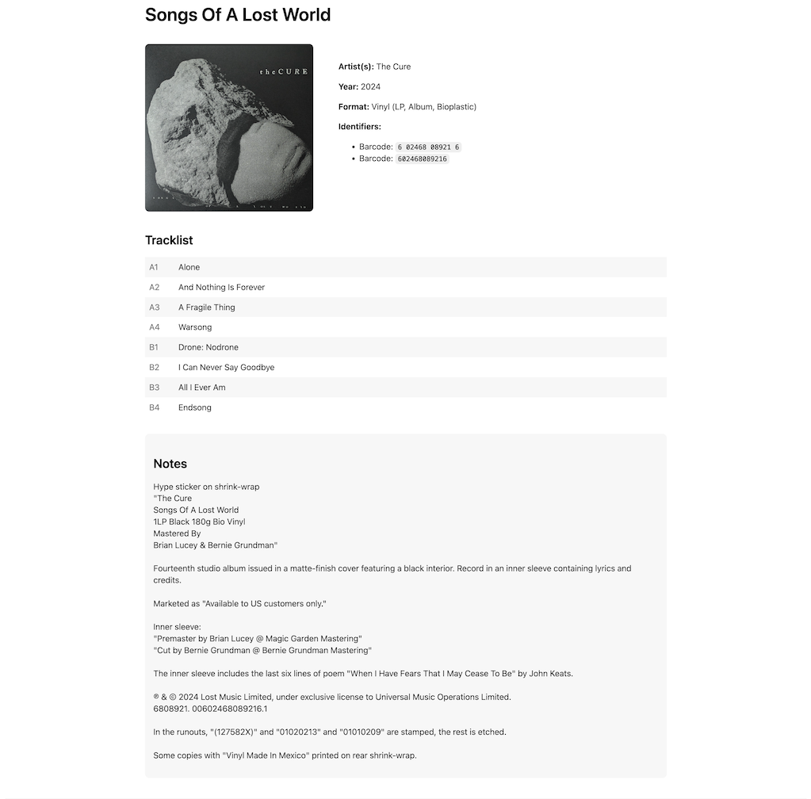

<h1>Discogs Helper</h1>

A PHP application to manage your music collection using the Discogs API. Features secure user authentication, personal collections, and detailed release management with cover art and comprehensive information.

<h2>My Collection Screen</h2>

  

<h2>Album Details</h2>

  

<h2>Features</h2>

<ul>
  <li>Secure user authentication and personal collections</li>
  <li>User profiles with customizable settings</li>
  <li>Advanced search functionality:
    <ul>
      <li>Search releases by artist/title</li>
      <li>Search by UPC/barcode</li>
    </ul>
  </li>
  <li>Comprehensive release management:
    <ul>
      <li>Preview release details before adding to collection</li>
      <li>Multiple cover image selection options</li>
      <li>Detailed release information display</li>
    </ul>
  </li>
  <li>Discogs integration:
    <ul>
      <li>Import existing Discogs collection</li>
      <li>Automatic cover image downloading</li>
      <li>Preservation of original Discogs metadata</li>
    </ul>
  </li>
  <li>Data security:
    <ul>
      <li>Secure user-specific data isolation</li>
      <li>SQLite database with automatic migrations</li>
      <li>Protected cover image storage</li>
    </ul>
  </li>
</ul>

<h2>Requirements</h2>

<ul>
  <li>PHP 8.3 or higher</li>
  <li>SQLite 3</li>
  <li>Composer</li>
  <li>Discogs API credentials</li>
  <li>Discogs account (for collection import and search)</li>
</ul>

<h2>Installation</h2>

<ol>
  <li>Clone the repository:
    <pre><code>git clone https://github.com/yourusername/discogs-helper.git
cd discogs-helper</code></pre>
  </li>

  <li>Install dependencies:
    <pre><code>composer install</code></pre>
  </li>

  <li>Create environment file:
    <pre><code>cp .env.example .env</code></pre>
  </li>

  <li>Configure your Discogs API credentials in .env:
    <pre><code>DISCOGS_CONSUMER_KEY=your_key_here
DISCOGS_CONSUMER_SECRET=your_secret_here</code></pre>
  </li>

  <li>Set up directory permissions:
    <pre><code>chmod -R 755 database
chmod -R 755 public/images/covers
chmod -R 755 logs</code></pre>
  </li>

  <li>Run database migrations:
    <pre><code>php bin/migrate.php</code></pre>
  </li>
</ol>

<h2>Usage</h2>

<ol>
  <li>Start the development server:
    <pre><code>php -S localhost:8000 -t public</code></pre>
  </li>

  <li>Open in your browser:
    <pre><code>http://localhost:8000</code></pre>
  </li>

  <li>First-time setup:
    <ul>
      <li>Register for a new account</li>
      <li>Log in to your account</li>
      <li>Set up your user profile</li>
      <li>Start building your personal collection</li>
    </ul>
  </li>

  <li>Core features:
    <ul>
      <li>Use "Add New Release" to search for music</li>
      <li>Search by artist/title or UPC/barcode</li>
      <li>Preview full release details</li>
      <li>Choose from available cover images</li>
      <li>Add releases to your personal collection</li>
      <li>View and manage your collection</li>
      <li>Import your existing Discogs collection</li>
    </ul>
  </li>
</ol>

<h2>Collection Import</h2>

The collection import feature includes:

<ul>
  <li>Batch processing with rate limit handling</li>
  <li>Automatic cover image downloads</li>
  <li>Original Discogs metadata preservation</li>
  <li>Duplicate detection and skipping</li>
  <li>Visual progress indication</li>
  <li>User-specific collection isolation</li>
</ul>

<h2>Database</h2>

The application uses SQLite for simplicity and reliability:

<ul>
  <li>Automatic database creation and migration</li>
  <li>Secure user authentication system</li>
  <li>Personal collections per user</li>
  <li>User profile storage</li>
  <li>Protected database location</li>
</ul>

<h2>Configuration</h2>

Required environment variables:

<ul>
  <li><code>DISCOGS_CONSUMER_KEY</code>: Your Discogs API consumer key</li>
  <li><code>DISCOGS_CONSUMER_SECRET</code>: Your Discogs API consumer secret</li>
</ul>

Additional configuration options in config/config.php:

<ul>
  <li>Database settings</li>
  <li>API configuration</li>
  <li>Rate limiting parameters</li>
  <li>Authentication options</li>
  <li>User profile settings</li>
</ul>

<h2>Security</h2>

<ul>
  <li>Secure user authentication with password hashing</li>
  <li>Individual user collection isolation</li>
  <li>Input sanitization and validation</li>
  <li>Secure file storage with randomized names</li>
  <li>Protected API credentials</li>
  <li>Session security measures</li>
  <li>Database security best practices</li>
</ul>

<h2>Error Handling</h2>

<ul>
  <li>Comprehensive error logging</li>
  <li>Automatic API rate limit management</li>
  <li>Duplicate entry prevention</li>
  <li>Detailed operation logging</li>
  <li>Security event tracking</li>
  <li>User-friendly error messages</li>
</ul>

<h2>Development</h2>

<ul>
  <li>Modern PHP architecture</li>
  <li>Template-based view system</li>
  <li>Structured logging system</li>
  <li>API integration management</li>
  <li>Authentication middleware</li>
  <li>User profile management</li>
</ul>

<h2>Contributing</h2>

<ol>
  <li>Fork the repository</li>
  <li>Create your feature branch (<code>git checkout -b feature/amazing-feature</code>)</li>
  <li>Commit your changes (<code>git commit -m 'Add some amazing feature'</code>)</li>
  <li>Push to the branch (<code>git push origin feature/amazing-feature</code>)</li>
  <li>Open a Pull Request</li>
</ol>

<h2>License</h2>

This project is licensed under the MIT License - see the LICENSE file for details.

<h2>Acknowledgments</h2>

<ul>
  <li><a href="https://www.discogs.com/developers">Discogs API</a> for providing the music database</li>
  <li><a href="https://www.sqlite.org/">SQLite</a> for reliable database storage</li>
  <li><a href="https://docs.guzzlephp.org/">GuzzleHTTP</a> for HTTP client functionality</li>
  <li><a href="https://github.com/vlucas/phpdotenv">phpdotenv</a> for environment configuration</li>
</ul>

<h2>Support</h2>

If you encounter any problems or have suggestions, please open an issue in the GitHub repository.

<h2>Deployment Considerations</h2>

When deploying to production:

<ul>
  <li>Enable HTTPS</li>
  <li>Keep dependencies updated</li>
  <li>Monitor authentication logs</li>
  <li>Implement regular backups</li>
  <li>Configure rate limiting</li>
  <li>Follow security best practices</li>
  <li>Set up monitoring</li>
</ul>