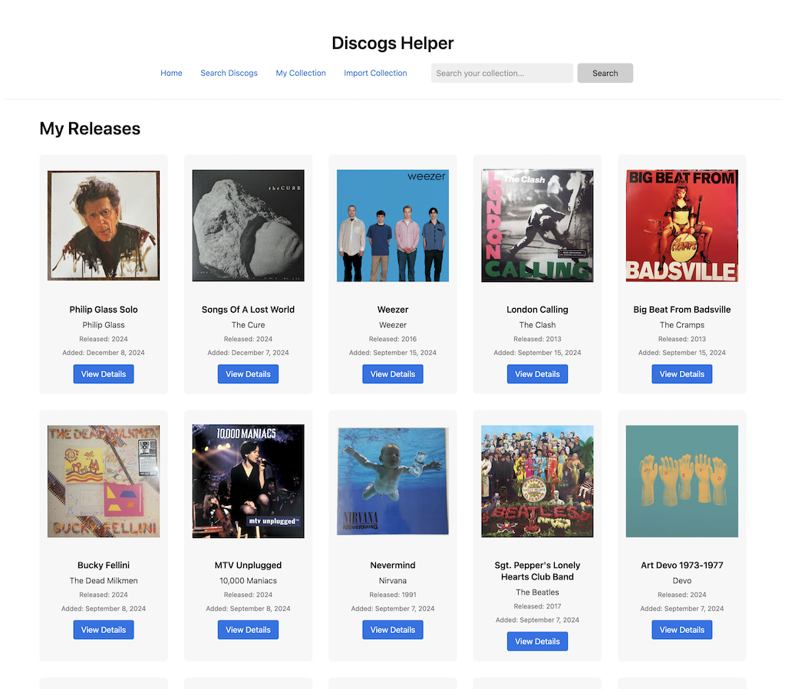

<h1>Discogs Helper</h1>

A PHP application to manage your music collection using the Discogs API. Features secure user authentication, personal collections, and detailed release management with cover art and comprehensive information.

<h2>My Collection Screen</h2>

  

<h2>Album Details</h2>

  

<h2>Features</h2>
<ul>
    <li>User Authentication
        <ul>
            <li>Secure login and registration</li>
            <li>Password protection</li>
            <li>User profiles with individual settings</li>
        </ul>
    </li>
    <li>Discogs Integration
        <ul>
            <li>Personal API credential management</li>
            <li>OAuth authentication for full API access</li>
            <li>Search Discogs database</li>
            <li>View detailed release information</li>
            <li>Import your Discogs collection</li>
            <li>Add individual releases to your local collection</li>
            <li>Import and manage your wantlist from Discogs</li>
            <li>Automatic Discogs wantlist synchronization</li>
        </ul>
    </li>
    <li>Collection Management
        <ul>
            <li>View your complete collection</li>
            <li>Automatic cover art downloading</li>
            <li>Format and release details</li>
            <li>Sorting options (by artist, title, date added)</li>
            <li>Filtering by format</li>
            <li>Search within collection</li>
            <li>Notes management</li>
            <li>Cover art selection</li>
            <li>One-click adding from wantlist to collection</li>
            <li>Dashboard with collection statistics and growth visualization</li>
        </ul>
    </li>
    <li>Wantlist Management
        <ul>
            <li>Sync wantlist with Discogs</li>
            <li>View detailed wantlist item information</li>
            <li>Add notes to wantlist items</li>
            <li>Automatic cover art management</li>
            <li>One-click removal from wantlist</li>
            <li>Direct addition to collection</li>
            <li>Automatic Discogs synchronization</li>
            <li>Duplicate checking during sync</li>
        </ul>
    </li>
</ul>

<h2>Requirements</h2>

<ul>
  <li>PHP 8.3 or higher</li>
  <li>SQLite 3</li>
  <li>Composer</li>
  <li>Discogs account and API credentials (for collection import and search)</li>
</ul>

<h2>Installation</h2>

<ol>
  <li>Clone the repository:
    <pre><code>git clone https://github.com/yourusername/discogs-helper.git
cd discogs-helper</code></pre>
  </li>

  <li>Install dependencies:
    <pre><code>composer install</code></pre>
  </li>

  <li>Set up directory permissions:
    <pre><code>chmod -R 755 database
chmod -R 755 public/images/covers
chmod -R 755 logs</code></pre>
  </li>

  <li>Run database migrations:
    <pre><code>php bin/migrate.php</code></pre>
  </li>
</ol>

<h2>Configuration</h2>
<ol>
    <li>Create a Discogs account if you don't have one</li>
    <li>Register your application at <a href="https://www.discogs.com/settings/developers">Discogs Developer Settings</a></li>
    <li>Get your Consumer Key and Consumer Secret</li>
    <li>In your Discogs Privacy settings, set "Allow others to browse my collection"</li>
    <li>Register an account in the local application</li>
    <li>Add your Discogs credentials in your profile settings</li>
    <li>Connect your account using OAuth for full API access</li>
</ol>

<h2>Usage</h2>

<ol>
  <li>Start the development server:
    <pre><code>php -S localhost:8000 -t public</code></pre>
  </li>

  <li>Open in your browser:
    <pre><code>http://localhost:8000</code></pre>
  </li>

  <li>First-time setup:
    <ul>
      <li>Register an account or log in</li>
    <li>Configure your Discogs credentials in your profile</li>
    <li>Use the search function to find releases</li>
    <li>Add releases to your collection individually</li>
    <li>Or import your entire Discogs collection</li>
    </ul>
  </li>

  <li>Core features:
    <ul>
      <li>Use "Add New Release" to search for music</li>
      <li>Search by artist/title or UPC/barcode</li>
      <li>Preview full release details</li>
      <li>Choose from available cover images</li>
      <li>Add releases to your personal collection</li>
      <li>View and manage your collection</li>
      <li>Import your existing Discogs collection</li>
      <li>Sync your Discogs wantlist</li>
    </ul>
  </li>
</ol>

<h2>Collection Import</h2>

The collection import feature includes:

<ul>
  <li>Batch processing with rate limit handling</li>
  <li>Automatic cover image downloads</li>
  <li>Original Discogs metadata preservation</li>
  <li>Duplicate detection and skipping</li>
  <li>Visual progress indication</li>
  <li>User-specific collection isolation</li>
  <li>Robust error handling:
    <ul>
      <li>Automatic retry with exponential backoff</li>
      <li>Graceful handling of server timeouts</li>
      <li>Real-time status updates</li>
      <li>Automatic recovery from temporary errors</li>
      <li>Conservative batch processing for reliability</li>
    </ul>
  </li>
</ul>

<h2>Database</h2>

The application uses SQLite for simplicity and reliability:

<ul>
  <li>Automatic database creation and migration</li>
  <li>Secure user authentication system</li>
  <li>Personal collections per user</li>
  <li>User profile storage</li>
  <li>Protected database location</li>
</ul>

<h2>Security</h2>

<ul>
<li>User passwords are securely hashed</li>
    <li>Individual API credentials per user</li>
    <li>Session-based authentication</li>
    <li>Input validation and sanitization</li>
  <li>Session security measures</li>
  <li>Database security best practices</li>
</ul>

<h2>Error Handling</h2>

<ul>
  <li>Comprehensive error logging</li>
  <li>Automatic API rate limit management</li>
  <li>Duplicate entry prevention</li>
  <li>Detailed operation logging</li>
  <li>Security event tracking</li>
  <li>User-friendly error messages</li>
</ul>

<h2>Development</h2>

<ul>
  <li>Modern PHP architecture</li>
  <li>Template-based view system</li>
  <li>Structured logging system</li>
  <li>API integration management</li>
  <li>Authentication middleware</li>
  <li>User profile management</li>
</ul>

<h2>Contributing</h2>

<ol>
  <li>Fork the repository</li>
  <li>Create your feature branch (<code>git checkout -b feature/amazing-feature</code>)</li>
  <li>Commit your changes (<code>git commit -m 'Add some amazing feature'</code>)</li>
  <li>Push to the branch (<code>git push origin feature/amazing-feature</code>)</li>
  <li>Open a Pull Request</li>
</ol>

<h2>License</h2>

This project is licensed under the MIT License - see the LICENSE file for details.

<h2>Acknowledgments</h2>

<ul>
  <li><a href="https://www.discogs.com/developers">Discogs API</a> for providing the music database</li>
  <li><a href="https://www.sqlite.org/">SQLite</a> for reliable database storage</li>
  <li><a href="https://docs.guzzlephp.org/">GuzzleHTTP</a> for HTTP client functionality</li>
</ul>

<h2>Support</h2>

If you encounter any problems or have suggestions, please open an issue in the GitHub repository.

<h2>Recent Updates</h2>
<ul>
    <li>Enhanced dashboard visualization:
        <ul>
            <li>Added streamlined collection growth chart</li>
            <li>Improved collection statistics display</li>
            <li>Added format distribution overview</li>
            <li>Added top artists section</li>
            <li>Enhanced mobile responsiveness</li>
        </ul>
    </li>
    <li>Enhanced collection import reliability:
        <ul>
            <li>Improved error handling with automatic retries</li>
            <li>Better handling of server timeouts</li>
            <li>More informative progress updates</li>
            <li>Graceful recovery from temporary errors</li>
        </ul>
    </li>
    <li>Added OAuth authentication for full Discogs API access</li>
    <li>Implemented comprehensive wantlist management
        <ul>
            <li>Sync with Discogs wantlist</li>
            <li>Cover image handling</li>
            <li>Detailed view for wantlist items</li>
            <li>Notes management for wantlist items</li>
            <li>One-click addition to collection</li>
            <li>Automatic Discogs wantlist removal</li>
        </ul>
    </li>
    <li>Enhanced security with OAuth token management</li>
    <li>Added rate limiting for API requests</li>
    <li>Improved error handling and user feedback</li>
    <li>Added duplicate checking during wantlist sync</li>
    <li>Updated UI for better user experience</li>
    <li>Added automatic cleanup of cover images</li>
    <li>Implemented CSRF protection for all operations</li>
    <li>Added comprehensive logging for debugging</li>
    <li>Previous updates:
        <ul>
            <li>Moved from environment variables to database-stored credentials</li>
            <li>Added user profiles with individual Discogs API credentials</li>
            <li>Improved session handling and security</li>
            <li>Added credential validation</li>
            <li>Enhanced error handling and user feedback</li>
            <li>Added release notes editing feature</li>
            <li>Added release details editing</li>
            <li>Added collection sorting and filtering</li>
            <li>Added cover art selection during import</li>
            <li>Added search within collection feature</li>
        </ul>
    </li>
</ul>

<h2>Pair Programming</h2>

Used the amazing <a href="https://www.cursor.com/">Cursor Editor</a> to pair program this application. Incredibly helpful tool.
